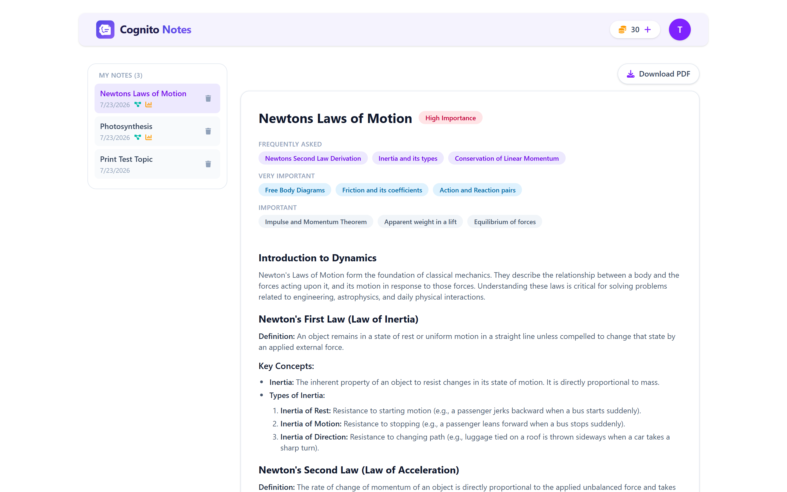
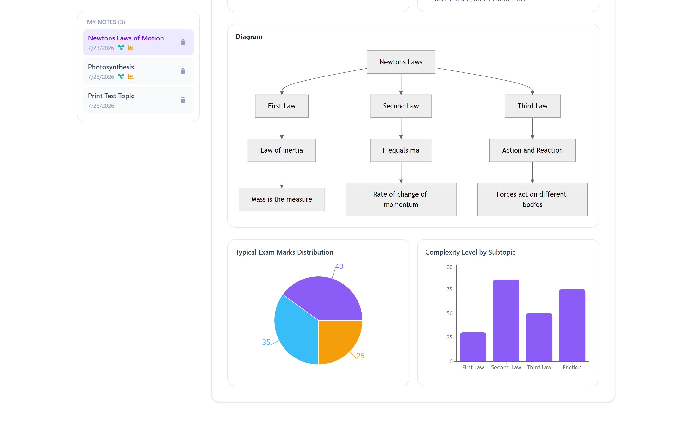
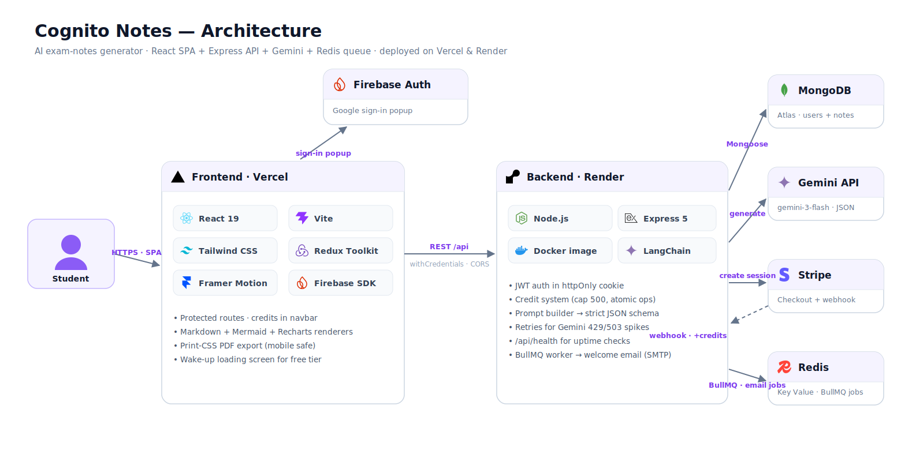

<div align="center">


### Type any topic → exam-ready AI notes with diagrams, charts and PDFs in ~30 seconds.

**[Live app](https://cognito-notes.vercel.app)** · React + Express + Gemini · deployed on Vercel & Render

</div>



---

## What it does

Cognito Notes is an AI study partner for students. Sign in with Google, get **50 free credits**, type a topic ("TCP vs UDP", "Photosynthesis", "Newton's Laws") and Gemini generates a complete study document:

- 📚 **Exam-focused notes** — markdown with headings, definitions, examples and exam tips, at three detail levels (brief / standard / detailed)
- ⭐ **Ranked subtopics** — frequently asked / very important / important chips
- ⚡ **Quick-revision sheet** and **practice questions** (short + long)
- 🧭 **Flow diagrams** — AI-written Mermaid, rendered as real SVG flowcharts
- 📊 **Charts** — AI-chosen bar / line / pie data rendered with Recharts
- 📄 **One-click PDF download** with the exact page layout (works on mobile)
- 💳 **Credit system with Stripe** — 1 credit per generation, buy more on the pricing page
- ✉️ **Welcome email on first sign-up** — queued through Redis + BullMQ
- 🗂 **History** — every note saved, browsable, re-downloadable, deletable




---

## Architecture



**Request flow:** the React SPA (Vercel) authenticates via Firebase's Google popup, then talks to the Express API (Docker container on Render) with an httpOnly JWT cookie. The API builds a strict JSON prompt, calls Gemini through LangChain, stores the result in MongoDB Atlas and deducts a credit. Stripe Checkout handles payments — credits are only granted by the **webhook**, never the redirect. First-time sign-ups enqueue a welcome-email job in Redis (BullMQ); an in-process worker sends it via SMTP with a graceful direct-send fallback if Redis is down.

## Tech stack

| Layer | Tech |
|---|---|
| Frontend | React 19, Vite, Tailwind CSS 4, Redux Toolkit, Framer Motion, react-markdown, Mermaid, Recharts |
| Auth | Firebase Google sign-in (client) → JWT in httpOnly cookie (server) |
| Backend | Node.js, Express 5, Mongoose, LangChain (`@langchain/google-genai`), BullMQ, Nodemailer + Mailgen |
| Data & infra | MongoDB Atlas, Redis (Docker locally / Render Key Value in prod), Docker, Vercel, Render |
| Payments | Stripe Checkout + signed webhooks |

## Engineering problems solved

| Problem | Root cause | Fix |
|---|---|---|
| Logout worked locally, silently failed in production | Cross-site cookie deletion: `clearCookie` without `SameSite=None; Secure` is rejected by browsers on cross-origin responses | Shared `cookieOptions` object used by both `res.cookie` and `res.clearCookie` |
| Gemini randomly returned "invalid JSON" | Output-token truncation — diagnosed via the `finishReason` field | Explicit `maxOutputTokens`, JSON response mode, retry on parse failure |
| PDF download printed the whole page on mobile | Mobile browsers don't support the iframe-print technique used by react-to-print | Plain `window.print()` + `print:hidden` CSS on everything except the note |
| Stripe webhook always failed signature verification | Global `express.json()` consumed the raw body the signature is computed over | Webhook route mounted with `express.raw()` **before** the JSON parser |
| White screen after adding new libraries | A stray root `node_modules` introduced a second copy of React; Vite's dep cache kept serving it | Removed duplicate install, cleared `node_modules/.vite` |
| Mermaid spammed "Syntax error" into the page | Mermaid v11 injects error SVGs into `document.body` on parse failures | `suppressErrorRendering: true` + sanitizing AI-generated labels |
| Sandbox testers could buy unlimited credits | Test-mode payments are free | Server-side credit cap (500) enforced before creating a checkout session |
| Concurrent generations sometimes failed | Free-tier Gemini throttles parallel requests per key | Retries with backoff now; billing tier / BullMQ job queue as the scale path |

## Run it locally

**Prereqs:** Node 20+, Docker Desktop, a MongoDB Atlas cluster, a [Gemini API key](https://aistudio.google.com), a Firebase project (Google sign-in enabled), Stripe test keys, and SMTP credentials (e.g. Gmail app password).

```bash
git clone <this-repo>

# 1. backend
cd backend
npm install
docker compose up -d        # starts Redis on :6379
# create backend/.env (see table below)
npm run dev                 # http://localhost:3000

# 2. frontend (new terminal)
cd frontend
npm install
# create frontend/.env with VITE_FIREBASE_APIKEY=<your firebase web api key>
npm run dev                 # http://localhost:5173

# 3. stripe webhooks (optional, new terminal)
stripe listen --forward-to localhost:3000/api/payment/webhook
```

### backend/.env

| Variable | Purpose |
|---|---|
| `PORT` | API port (3000 in dev; Render injects its own) |
| `MONGO_URI` | MongoDB Atlas connection string |
| `JWT_SECRET` | Signs the auth cookie |
| `NODE_ENV` | `development` / `production` (controls cookie flags) |
| `FRONTEND_URL` / `CLIENT_URL` | Frontend origin — CORS + Stripe redirects + email links |
| `GEMINI_API_KEY` | Google AI Studio key |
| `STRIPE_SECRET_KEY` / `STRIPE_WEBHOOK_SECRET` | Stripe test keys |
| `SMTP_HOST` / `SMTP_PORT` / `SMTP_USER` / `SMTP_PASS` / `SENDER_EMAIL` | Welcome-email SMTP |
| `REDIS_URL` | Optional locally (defaults to `redis://localhost:6379`); Render Key Value URL in prod |

## API overview

| Method & path | Auth | Purpose |
|---|---|---|
| `POST /api/auth/google` | — | Sign in / first-time sign-up (queues welcome email) |
| `POST /api/auth/logout` | — | Clear session cookie |
| `GET /api/user/me` | 🔒 | Current user + credits |
| `POST /api/notes/generate` | 🔒 | Generate notes (1 credit) |
| `GET /api/notes/my-notes` | 🔒 | All of the user's notes, newest first |
| `DELETE /api/notes/:id` | 🔒 | Delete own note |
| `POST /api/payment/checkout` | 🔒 | Create Stripe Checkout session (credit cap enforced) |
| `POST /api/payment/webhook` | Stripe signature | Grant credits on `checkout.session.completed` |
| `GET /api/health` | — | Uptime / wake-up check |

## Deployment notes

- **Frontend → Vercel.** Add the production domain to Firebase's authorized domains.
- **Backend → Render** (Docker runtime, root directory `backend`). Set all env vars; don't set `PORT`.
- **Redis → Render Key Value** (free tier, maxmemory policy **`noeviction`**) → its internal URL becomes `REDIS_URL`.
- **MongoDB Atlas:** allow Render's outbound IPs (or `0.0.0.0/0`) in Network Access.
- **Stripe:** add a webhook endpoint for `checkout.session.completed` pointing at `/api/payment/webhook`, and use its signing secret.
- Free-tier Render sleeps after idle — the frontend shows a "waking up the server" screen during the ~50 s cold start, and `/api/health` works with uptime pingers.

## Roadmap

- [ ] Verify Firebase ID tokens server-side (`firebase-admin`) instead of trusting the client
- [ ] Move note generation itself onto the BullMQ queue with real progress
- [ ] Per-user rate limiting
- [ ] Paid Gemini tier for true concurrent generation
- [ ] Custom domain

---

<div align="center">Built by <b>Mubeen Khan</b> — React · Node · MongoDB · Gemini</div>
